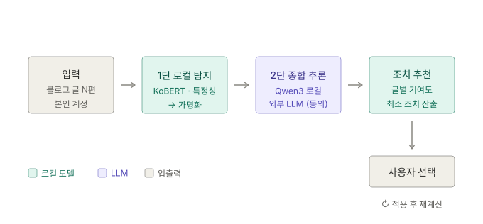
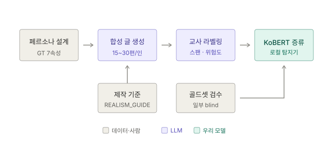

# KISIA Project — 결합 재식별 위험 탐지·완화 시스템

> 개별 글이 아니라 **글들의 결합**에서 발생하는 개인정보 재식별 위험을 **탐지하여 정량화**하고, 그에 맞는 **최소 조치를 추천**하는 시스템.
>
> 조치는 리라이트 · 비공개 · 활동 메타 관리 중 **사용자가 고르며**, 탐지는 **외부 전송 없이 로컬에서** 수행한다.

AI 보안기술개발 · 개인정보 트랙 · 기간 4개월 · 팀 5명
작업명: 벤치마크 `KoPrivacyLeak` / 모델 `KoPrivacyLeak-Detector` (확정 아님)

---

## 왜 이 주제인가

이름·주소를 **한 번도 쓰지 않은 글**에서 나이·성별·거주지·직장·가족·통근·소득 7속성이 추론된다. 선행 PoC에서 합성 페르소나 6종에 대해 자체 측정한 결과다.

| 페르소나 | 유형 | 추론 성공 | 재식별 위험도 |
|---|---|---|---|
| R1 | 40대 남 · 등산/낚시 | **7/7** | 76.1 |
| R2 | 20대 여대생 · 덕질 | **7/7** | 83.0 |
| R3 | 30대 워킹맘 | **7/7** | 82.8 |
| R4 | 60대 여 · 손주 | **7/7** | 78.7 |
| R5 | 20대 남 · 해외 워홀 | **7/7** | 72.8 |
| R6 | 30대 여 · 지방 카페 사장 | 6/7 | 70.0 |

**핵심은 누적이다** — R1 기준 글 1편일 때 4/7·위험도 26.7이지만, **5편이면 7/7·69.2**가 된다.

그리고 **명시적 PII를 지워도 막히지 않는다** — 명시 단서를 제거한 ablation에서 7속성이 그대로 적중했고 위험도만 10~13점 하락했다. 명시 PII 탐지기만으로는 문제가 해결되지 않는다는 뜻이며, 이것이 이 프로젝트의 전제다.

---

## 서비스 예시 — 실제 측정 사례로 따라가기

아래는 합성 페르소나 **R1**(40대 남성 · 등산/낚시 취미 블로그)을 실제 파이프라인에 돌린 결과다.
수치는 전부 자체 측정값이며, **합성 인물이므로 실존 개인과 무관하다.**

### 0. 이런 글을 씁니다

블로거는 신상을 쓴 적이 없다. 이름도, 주소도, 나이도 직접 적지 않았다.

> **2024.03.16 — 주말 조황**
> 집 근처라 자주 가는 **신갈저수지** 조황입니다. 새벽 5시에 나갔는데 물이 아직 차네요. 붕어 몇 마리 보고 철수. **마흔여덟** 되니 새벽 찬바람이 예전 같지 않습니다.

> **2024.03.22 — 이번 주**
> **완성차 공장 출장**이 잦아서 피곤하네요. **제조업** 쪽에 있다 보니 부품은 좀 따지게 됩니다. 왕복 몇 시간씩 **운전**하고 현장 돌면 파김치가 됩니다.

> **2024.12.28 — 연말**
> **첫째가 고등학교 배정**을 받았습니다. **둘째는 중학교** 다니는데 둘 다 사춘기라 말수가 줄었네요. 애들 대학 갈 때까진 버텨야죠.

> **2025.06.02 — 퇴근 후**
> 퇴근하고 **기흥호수** 잠깐 나갔는데 사람이 많더군요. 동네 낚시터라 퇴근하고 한두 시간 앉았다 오기 딱입니다.

한 편씩 보면 전부 평범한 취미 글이다.

### 1. 스캔 — 글이 쌓이면 위험이 오른다

| 투입 글 수 | 1편 | 5편 | 10편 | 19편 |
|---|---|---|---|---|
| 추론 성공 | 4/7 | **7/7** | 7/7 | 7/7 |
| 재식별 위험도 | 26.7 | 69.2 | 71.9 | **79.7** |

글 1편으로는 거주지를 맞히지 못한다. **5편이면 전 속성이 뚫린다.**

### 2. 진단 — AI가 추정한 당신

| 속성 | 추정값 | 신뢰도 | 근거 |
|---|---|---|---|
| **거주지** | **경기 용인 기흥·신갈** | 72% | "신갈저수지" + "기흥호수" — **낚시터 이름 두 개** |
| 나이 | 약 49세 (실제 48) | 88% | "마흔여덟" · "무릎이 예전 같지 않네요" |
| 성별 | 남성 | 96% | "아빠는 그저 뒷바라지할 뿐" · 닉네임 |
| 직장 | 자동차부품 제조업 | 82% | "완성차 공장 출장" · "제조업 쪽에 있다 보니" |
| 가족 | 배우자 + 자녀 2명 (고1·중2) | 90% | "첫째가 고등학교 배정" |
| 통근 | 자차 · 장거리 출장 잦음 | 75% | "왕복 몇 시간씩 운전" |
| 소득 | 중간 | 33% | 근거 약함 — **단정하지 않음** |

**주소를 한 번도 쓰지 않았는데 낚시터 이름만으로 거주지가 동 단위까지 좁혀졌다.** 취미 정보가 곧 위치 정보가 된 사례다. 심지어 다른 글의 "동탄 사는 지인"은 *지인의* 거주지로 구분해냈다.

마지막 줄도 중요하다. 근거가 약한 항목은 신뢰도를 낮게 내고 단정하지 않는다. 신호가 없는 일상글(대조군 N1)에 대해서는 **위험도 8.8, 7속성 중 6개를 스스로 기권**했다 — 아무 글에나 겁주지 않는다.

### 3. 조치 — 무엇을 얼마나 되돌릴까

속성별 위험 기여도(실측):

| 가족 | 거주지 | 통근 | 직장 | 나이 | 성별 | 소득 |
|---|---|---|---|---|---|---|
| 15.9 | 14.1 | 13.2 | 12.9 | 8.6 | 7.5 | 3.9 |

사용자는 부담과 효과를 보고 조치를 고른다:

| 조치 | 예시 | 사용자 부담 |
|---|---|---|
| **리라이트** | "신갈저수지" → "동네 저수지" | 높음 — 글이 바뀜 |
| **활동 메타 관리** | 닉네임 · 위치태그 · 활동 시간대 | 중간 |
| **비공개** | 기여도 높은 글만 선택적으로 | **낮음 — 고르기만** |

**3단계 조치 적용 결과 (실측): 위험도 79 → 31 (−61%)**

단계별로 보면 **활동 메타 관리가 가장 큰 폭을 만들었다.** 글을 고치는 것보다 활동 흔적을 정리하는 쪽이 효율이 높았다는 뜻이며, 서비스가 사용자에게 전달해야 할 핵심 메시지다.

> **아직 측정 전** — 글 단위 한계 기여도("이 글을 비공개하면 −18")는 M2 산출물이다. 위 −61%는 전체 조치를 적용한 기준이며, *최소* 조치 조합 탐색은 M3에서 다룬다.

---

## 시스템 구조

### 런타임 — 탐지에서 조치까지

### 오프라인 — 합성 코퍼스 제작에서 증류 학습까지

### 학습하는 모델 2종

| 모델 | 위치 | 방식 | 담당 |
|---|---|---|---|
| KoBERT / KoELECTRA (110M) | 1단 스팬 탐지 | full fine-tuning | B |
| **Qwen3-4B** | 2단 종합 추론 | **QLoRA (4bit)** | D |

**2단까지 로컬이어야 "외부 전송 0"이 실제로 성립한다.** 프라이버시 위험을 검사한다고 사용자 글을 외부 LLM API로 보내면 그 도구 자체가 침해이기 때문이다.

---

## 문서

| 파일 | 내용 |
|---|---|
| [docs/plan.md](docs/plan.md) | **프로젝트 계획서 (v2.1)** — 문제·서비스·모델·데이터·로드맵·평가·컴플라이언스 전체 |
| [docs/diagrams/](docs/diagrams/) | 런타임 · 오프라인 파이프라인 다이어그램 |

---

## 데이터 원칙

- **개발·학습 코퍼스는 전량 합성** (실존 인물 0) — 윤리 청정 + GT 완벽 통제 + 벤치마크 공개 가능
- **M4 외적 타당성 검증만** 동의받은 실블로거 10~20명, **로컬 전용 처리 · 분석 후 즉시 파기**
- 무동의 수집 데이터는 사용하지 않는다

자세한 근거와 5중 방어 논리는 [계획서 §6](docs/plan.md) 참조.

---

## 현재 상태

계획 확정 단계. 첫 2주 액션 아이템은 [계획서 §14](docs/plan.md) 참조.

주요 미결 사항:
- [ ] 팀원 GPU 확보 (**B·D 2대 필요**)
- [ ] 라벨 스키마 — TAB 가이드라인 한국어 적응안 합의
- [ ] 베이스라인 3종 수치 (규칙 / Presidio·korean-pii / LLM 직접)
- [ ] 합성 코퍼스 생성 파이프라인 착수
